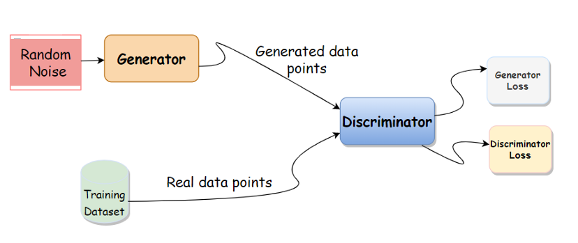
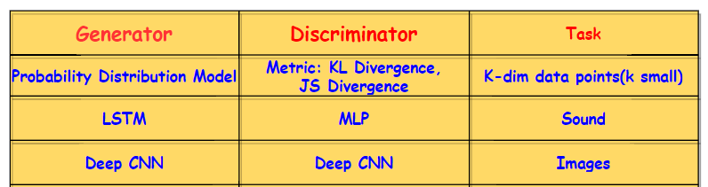

# Generative-Adversarial-Network

Generative Adversarial Networks (GANs), a new framework for estimating generative models via an adversarial process, in which we simultaneously train two models:

1. Generator model: It captures the data distribution and generates similar data points.
2. Discriminator model: It estimates the probability that a sample came from the training data rather than the Generator model.

**The training procedure for Generator model is to maximize the probability of Discriminator model making a mistake.**

The idea is to generate a similar data point by extracting the underlying distributions and patterns in the training set.

Underlying Generator and Discriminator models changes depending upon the task at hand.

Refer Blog: https://medium.com/@amitdlmlai/gans-generative-adversarial-network-92ec9b67864b